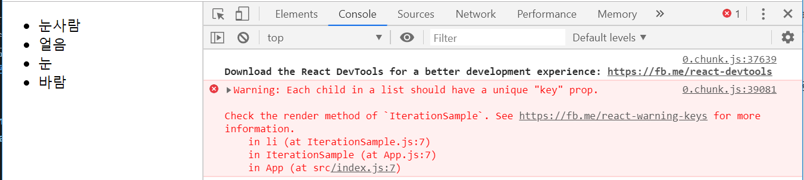

# 6장 컴포넌트 반복
## 6.1 자바스크립트 배열의 map() 함수
> 반복되는 컴포넌트를 렌더링할 수 있음
> 파라미터로 전달된 함수를 사용해서 배열 내 각 요소를 원하는 규칙에 따라 변환한 후 그 결과로 새로운 배열을 생성함.
### 6.1.1 문법
> arr.map(callback, [thisArg])
* map() 함수의 파라미터
    * callback : 새로운 배열의 요소를 생성하는 함수, 3가지 파라미터를 가지고 있음
      - currentValue : 현재 처리하고 있는 요소
      - index : 현재 처리하고 있는 요소의 index 값 (0부터 시작함)
      - array : 현재 처리하고 있는 원본 배열
    * thisArg(선택항목) : callback함수 내부에서 사용할 this 컨퍼런스
### 6.1.2 예제
> map함수를 사용하여 배열[1,2,3,4,5]의 각 요소를 제곱해서 새로운 배열을 생성하기
```javascript
// 변수 선언
var numbers = [1,2,3,4,5];

// num은 map함수 안에서 currentValue로 사용할 변수명
// numbers배열에 있는 값을 map함수를 이용해서 수식을 적용 후 processed에 담아줌.
var processed = numbers.map(function(num) {
    return num * num;
});

console.log(processed);
```
* ES6 문법으로 작성
```javascript
const numbers = [1,2,3,4,5];
const result = numbers.map(num => num * num);
console.log(result);
```
* 함수안에서 복잡한 수식이 필요 할 경우 (feat.ES6)
```javascript
const numbers = [1,2,3,4,5];
const result = numbers.map(num => {
    // 추가로 필요한 수식들 ex) if문 등
    return num * num;
});
```
## 6.2 데이터 배열을 컴포넌트 배열로 변환하기
> 6.1 과 똑같은 원리로 기존 배열로 컴포넌트로 구성된 배열을 생성할 수도 있음
### 6.2.1 컴포넌트 수정하기
```javascript
//IterationSample.js (p.161)
import React from 'react';

const IterationSample = () => {
  const names = ['눈사람', '얼음', '눈', '바람'];

  // 기본예제
  const nameList = names.map(name => <li>{name}</li>);
  return <ul>{nameList}</ul>;

  // 참고예제) 조건문 사용
  // const nameList = names.map(name => {
  //   if (name === '얼음') {
  //     return <li>{name}</li>
  //   }
  // });
  // return <ul>{nameList}</ul>;
};

export default IterationSample;
```
 * names 배열 값을 이용하여  ```<li>...</li>``` JSX 코드로 된 배열을 새로 생성한 후 nameList에 담음
 * 예제처럼 map함수를 이용해서 DOM 요소를 작성해도 되고, 컴포넌트를 사용해도 됨.
#### 6.2.2 App 컴포넌트에서 예제 컴포넌트 렌더링
```javascript
//App.js (p.161)
import React, {Component} from 'react';
import IterationSample from './IterationSample';

class App extends Component {
  render() {
    return (
      <IterationSample/>
    );
  }
}

export default App;
```
* 코드결과 화면
  * 위 코드 실행결과 원하는 대로 렌더링이 되었지만 개발자 도구의 콘솔을 보면 "key" prop가 없다는 경고가 발생하였음. [6.3key](##-6.3-key)에서 다룰 예정

## 6.3 key
* key는 컴포넌트 배열을 렌더링했을 때 어떤 원소에 변동(생성, 제거, 수정 등)이 있었는지 알아내기 위해 사용함.
* key가 없어도 리스트를 순차적으로 비교하면서 변화를 감지하지만, key가 있다면 이 값을 사용하여 어떤 변화가 일어났는지 빠르게 감지를 할 수 있기 때문에 사용
### 6.3.1 key 설정
* key값은 언제나 반드시 유일해야함.
* map 함수의 인자로 전달되는 함수 내부에서 컴포넌트 props를 설정하듯이 설정하면 됨.
```javascript
const articleList = artivles.map(article => {
    <Artivle
        title={article.title}
        writer={article.writer}
        key={article.id}
    />
})
```

* 하지만, [위에서-보았던-예제](###-6.2.1-컴포넌트-수정하기) 컴포넌트에는 **key값으로 사용할 만한 고유번호가 없음**
이럴 경우에는 **map함수에 전달되는 콜백 함수인 index값 사용**하면 됨.(그러나, 비효율정인 방법! 꼭 고유값을 사용할게 없는 경우에만 사용하기)

```javascript
//IterationSample.js (p.163)
import React from 'react';

const IterationSample = () => {
  const names = ['눈사람', '얼음', '눈', '바람'];
  const nameList = names.map((name, item) => <li key={index}>{name}</li>);
  return <ul>{nameList}</ul>;
};

export default IterationSample;
```

## 6.4 응용
> 1. 고정된 배열이 아닌 동적인 배열을 렌더링 해보기
> 2. index로 key를 사용해야 하는 경우 새로운 고윳값 만드는 방법
### 6.4.1 초기 상태 설정하기
* 진행할 예제
   * IterationSample 컴포넌트에서 useState를 사용하여 상태를 설정
   * 세가지 상태를 추가하여 사용
      1. 데이터 배열
      1. 텍스트 입력할 input
      1. 새로운 항목을 추가할 때 사용할 고유 id값

```javascript
//IterationSample.js (p.164)
import React, { useState } from 'react';

const IterationSample = () => {
    // 문자열 -> 객체 로 변환 (id값을 콜백index 대신 key값으로 사용하기 위해)
    const [names, setNames] = useState([
        { id: 1, text: '눈사람'},
        { id: 2, text: '얼음'},
        { id: 3, text: '눈'},
        { id: 4, text: '바람'}
    ]);

    // 새로운 값을 입력 받기 위해 선언
    const [inputText, setInputText] = useState('')
    const [nextId, setNextId] = useState(5);

    const namesList = names.map(name => <li key={name.id}>{name.text}</li>);
    return <ul>{namesList}</ul>;
};

export default IterationSample;
```

### 6.4.2 데이터 추가 기능 구현하기
```javascript
//IterationSample.js (p.165)
import React from 'react';

const IterationSample = () => {
  const [names, setNames] = useState([
    { id: 1, text: '눈사람'},
    { id: 2, text: '얼음'},
    { id: 3, text: '눈'},
    { id: 4, text: '바람'}
  ]);
  const [inputText, setInputText] = useState('')
  const [nextId, setNextId] = useState(5);

  // 1. 추가로 받을 input버튼과 추가 버튼 구현
  const onChange = e => setInputText(e.target.value);

  // 2. 추가버튼 눌렀을 떄 액션 연결
  const onClick = () => {
      // .concat : 배열 합치는 함수
      const nextNames = names.concat({
          id: nextId, // nextId 값을 id로 설정
          text: inputText // input에 입력한 값을 text로 설정
      });
      // 다음 입력받을 값을 위해 준비
      setNextId(nextId + 1);
      setNames(nextNames);
      setInputText('');
  }
  const namesList = names.map(name => <li key={name.id}>{name.text}</li>);
  return (
    <>
      <input value={inputText} onChange={onChange}/>
      <button onClick={onClick}>추가</button>
      <ul>{namesList}</ul>
    </>
  );
};

export default IterationSample;
```

* **push**는 기존 배열에 추가  / **concat**은 기존의 값+추가할 값 = 새로운배열 생성
* 리엑트 에서는 성능 최적화 하기 위해서 **불변성 유지**를 해야함
* 불변성 유지 란? 상태 업데이트 시 기존의 값은 그대로 두고 새로 만들어서 업데이트 하는 것.
#### 6.4.3 데이터 제거 기능 구현하기
> 각 항목을 더블클릭했을 때 해당 항목이 사라지는 기능 구현
> 불변성을 유지하며 배열의 특정 항목을 지우기 위해서는 **내장 함수 filter**를 사용
* filter함수 : 해당 조건에 해당하는 값만 return 함.

```javascript
const numbers = [1, 2, 3, 4, 5, 6];
const biggerThanThree = numbers.filter(number => number > 3);
// 결과 : [4, 5, 6]
```

```javascript
// 특정 원소만 제외 시키기
const numbers = [1, 2, 3, 4, 5, 6];
const biggerThanThree = numbers.filter(number => number !== 3);
// 결과 : [1, 2, 4, 5, 6]
```
```javascript
//IterationSample.js
import React from 'react';

const IterationSample = () => {
  const [names, setNames] = useState([
    { id: 1, text: '눈사람'},
    { id: 2, text: '얼음'},
    { id: 3, text: '눈'},
    { id: 4, text: '바람'}
  ]);
  const [inputText, setInputText] = useState('')
  const [nextId, setNextId] = useState(5);

  const onChange = e => setInputText(e.target.value);

  const onClick = () => {
      const nextNames = names.concat({
          id: nextId, // nextId 값을 id로 설정
          text: inputText // input에 입력한 값을 text로 설정
      });
      // 다음 입력받을 값을 위해 준비
      setNextId(nextId + 1);
      setNames(nextNames);
      setInputText('');
  };
  // onDoubleClick 를 사용해서 삭제
  const namesList = names.map(name => {
    <li key={name.id} onDoubleClick={() => onRemove(name.id)}>
      {name.text}
    </li>
  });
  return (
    <>
      <input value={inputText} onChange={onChange}/>
      <button onClick={onClick}>추가</button>
      <ul>{namesList}</ul>
    </>
  );
};

export default IterationSample;
```

## 정리
* map 함수 : 반복된 값을 출럭하는 경우 사용
* map 함수를 사용할 때 각 내용의 고유한 값인 key를 사용해야함
* 만약 key로 사용할 만한 값이 없을 경우 객체형태로 변경 후 고유값 (ex. id)를 만들어 넣어주기
* 배열에서 사용하는 puch, concat 함수의 차이
* 배열을 업데이트 혹은 삭제할 때는 불변성을 유지 하면서 변경해야 함
