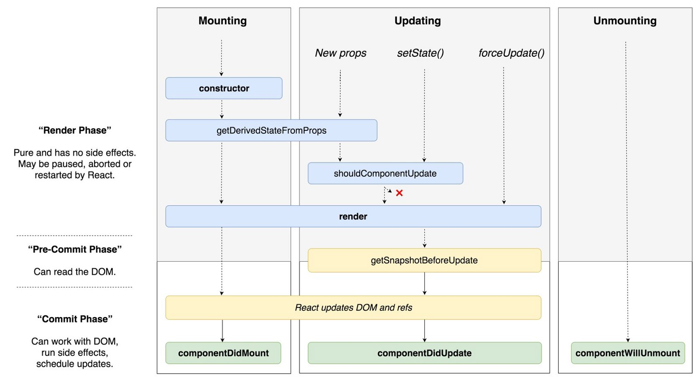

# 7장 라이프사이클
라이프사이클 메서드는 클래스형 컴포넌트에서만 사용할 수 있습니다. 함수형 컴포넌트에서는 라이프사이클 대신 Hooks 기능을 사용하여 비슷한 작업을 처리합니다.

## 7.1 라이프사이클 메서드의 이해
라이프사이클 메서드의 종류는 총 아홉가지 입니다. __Will__ 접두사는 작업을 작동하기 __전__, __Did 접두사는 작업을 작당한 __후__에 실행되는 메서드입니다.
라이프 사이클은 __마운트, 업데이트, 언마운트__ 로 나뉩니다.

## 라이프사이클의 흐름


#### 마운트
DOM이 생성되고 웹 브라우저상에 나타나는 것을 마운트(mount)라고 합니다.
- constructor: 컴포넌트를 새로 만들때마다 호출되는 클래스 생성자 메서드
- getDerivedStateFromProps: props에 있는 값을 state에 넣을때 사용하는 메서드
- render: UI를 렌더링하는 메서드
- componentDidMount: 컴포넌트가 웹 브라우저상에 나타난 후 호출하는 메서드

#### 업데이트
컴포넌트가 업데이트하는 경우
1. props가 바뀔때
2. state가 바뀔때
3. 부모 컴포넌트가 리렌더링될 때
4. this.forceUpdate로 강제로 렌더링을 트리거할 때

- getDerivedStateFromProps: props의 변화에 따라 state 값에도 변화를 주고싶을때 사용합니다.
- shouldComponentUpdate: 컴포넌트가 리렌더링을 해야 할지 말아야 할지를 결정하는 메서드
- render: 컴포넌트 리렌더링
- getSnapshotBeforeUpdate: 컴포넌트 변화를 DOM에 반영하기 바로 직전에 호출하는 메서드
- componentDidUpdate: 업데이트 작업이 끝난 후 호출하는 메서드

#### 언마운트
컴포넌트를 DOM에서 제거하는것을 언마운트(unmount))라고 합니다.
- componentWillUnmount: 컴포넌트가 웹상에서 사라지기 전에 호출하는 메서드

## 7.2 라이프사이클 메서드 살펴보기
### 7.2.1 render() 함수
이 메서드 안에서는 this.props와 this.state에 접근할 수 있으며, 리액트 요소를 반환합니다. 요소는 태그가 될 수도 있고, 컴포넌트가 될 수도 있습니다. 아무것도 보여주고싶지 않다면 null이나 false값을 반환합니다.

주의사항  
이 메서드 안에서는 이벤트 설정이 아닌 곳에서 setState를 사용하면 안되며, 브라우저 DOM에 접근해서도 안됩니다. DOM의 정보를 가져오거나 state에 변화를 줄때는 componentDidMount에서 처리합니다.

### 7.2.2 constructor 메서드
생성자 메서드. 초기 state를 정할수 있습니다.
```javascript
constructor(props){
    super(props)    //this를 할당
}
```
### 7.2.3 getDerivedStateFromProps 메서드
리액트 v16.3 이후에 새로 만든 라이프사이클 메서드. props로 받아온 값을 state에 동기화 시키는 용도로 사용. 컴포넌트가 마운트될때와 업데이트될때 호출됩니다.

`componentWillReceiveProps의 대체 역할로 작성된 메서드로 컴포넌트가 인스턴스화 된 후, 새 props를 받았을 때 호출된다. 주의할 점으로 setState를 사용하는 것이 아닌 값을 retrun 해야한다. state를 갱신하는 객체를 반환할 수 있고, 새로운 props가 state 갱신을 필요로 하지 않음을 나타내기 위해 null을 반환할 수도 있다.`
- 이전코드
```js
componentWillReceiveProps(nextProps) {
  if (this.props.value !== nextProps.value) {
    this.setState({ value: nextProps.value });
  }
}

```
- 개선코드
```javascript
static getDerivedStateFromProps(nextProps, prevState){
  if(nextProps.value !== prevState.value) {   // 조건에 따라 특정 값 동기화
      return {value: nextProps.value}
  }
  return null; // state를 변경할 필요가 없다면 null을 반환
}
```
### 7.2.4 componentDidMount 메서드
첫렌더링을 다 마친후 실행합니다.
```javascript
componentDidMount(){
    //...
}
```

### 7.2.5 shouldComponentUpdate 메서드
props 또는 state를 변경했을 때, 리렌더링을 시작할지 여부를 지정하는 메서드 입니다. 
```javascript
shouldComponentUpdate(nextProps, nextState){
    return nextProps.id !== this.props.id;
}
```

### 7.2.6 getSnapshotBeforeUpdate 메서드
리액트 v16.3 이후 만든 메서드. 이 메서드는 render에서 만들어진 결과물이 브라우저에 실제로 반영하기 직전에 호출하는 메서드.  
이 메서드에서 반환하는 값은 componentDidUpdate에서 세번째 파라미터인 snapshot 값으로 전달받을수 있습니다. 주로 업데이트 직전의 값을 참고할 일이 있을때 활용합니다.(예:스크롤바 위치 유지)

```javascript
getSnapshotBeforeUpdate(prevProps, prevState){
    if(prevState.array !== this.state.array){
        const { scrollTop, scrollHeight} = this.list
        return { scrollTop, scrollHeight };
    }
}
```
### 7.2.7 componentDidUpdate 메서드
리렌더링 완료 후에 실행합니다. 업데이트가 끝난 직후이므로, DOM관련 처리를 해도 무방합니다. getSnapshotBeforeUpdate에서 반환한 값이 있다면 여기서 snapshot값을 전달받을수 있습니다.
```javascript
componentDidUpdate(prevProps, prevState, snapshot){
    //...
}
```
### 7.2.8 componentWillUnmount 메서드
DOM을 제거할 때 실행합니다.
```javascript
componentWillUnmount(){
    //...
}
```
### 7.2.9 componentDidCatch 메서드
리액트 v16에서 새롭게 도입. 컴포넌트 렌더링 도중에 에러가 발생했을 때 오류 UI를 보여줄 수 있게 해줍니다.
```javascript
componentDidCatch(error, info){
    this.setState({
        error:true
    });
    console.log({error, info})
}
```

## 7.3 라이프 사이클 메서드 사용하기
### 7.3.1 
```javascript
import React, { Component } from 'react';
class LifeCycleSample extends Component {
  state = {
    number: 0,
    color: null
  };
  myRef = null; // ref를 설정할 부분
  constructor(props) {
    super(props);
    console.log('constructor');
  }
  static getDerivedStateFromProps(nextProps, prevState) {
    console.log('getDerivedStateFromProps');
    if (nextProps.color !== prevState.color) {
      return { color: nextProps.color };
    }
    return null;
  }
  componentDidMount() {
    console.log('componentDidMount');
  }
  shouldComponentUpdate(nextProps, nextState) {
    console.log('shouldComponentUpdate', nextProps, nextState);
    // 숫자의 마지막 자리가 4면 리렌더링하지 않습니다.
    return nextState.number % 10 !== 4;
  }
  componentWillUnmount() {
    console.log('componentWillUnmount');
  }
  handleClick = () => {
    this.setState({
      number: this.state.number + 1
    });
  };
  getSnapshotBeforeUpdate(prevProps, prevState) {
    console.log('getSnapshotBeforeUpdate');
    if (prevProps.color !== this.props.color) {
      return this.myRef.style.color;
    }
    return null;
  }
  componentDidUpdate(prevProps, prevState, snapshot) {
    console.log('componentDidUpdate', prevProps, prevState);
    if (snapshot) {
      console.log('업데이트되기 직전 색상: ', snapshot);
    }
  }
  render() {
    console.log('render');
    const style = {
      color: this.props.color
    };
    return (
      <div>
        {/* {this.props.missing.value} */}
        <h1 style={style} ref={ref => (this.myRef = ref)}>
          {this.state.number}
        </h1>
        <p>color: {this.state.color}</p>
        <button onClick={this.handleClick}>더하기</button>
      </div>
    );
  }
}
export default LifeCycleSample;

```
### 7.3.2 App 컴포넌트에서 예제 컴포넌트 사용
```javascript
import React, { Component } from 'react';
import LifeCycleSample from './LifeCycleSample';
//import ErrorBoundary from './ErrorBoundary';

// 랜덤 색상을 생성합니다.
function getRandomColor() {
  return '#' + Math.floor(Math.random() * 16777215).toString(16);
}
class App extends Component {
  state = {
    color: '#000000'
  };
  handleClick = () => {
    this.setState({
      color: getRandomColor()
    });
  };
  render() {
    return (
      <div>
        <button onClick={this.handleClick}>랜덤 색상</button>
        {/*<ErrorBoundary>
          <LifeCycleSample color={this.state.color} />
        </ErrorBoundary>*/}
      </div>
    );
  }
}
export default App;
```
### 7.3.3 에러 잡아내기
```javascript
import React, { Component } from 'react';

class ErrorBoundary extends Component {
  state = {
    error: false
  };
  componentDidCatch(error, info) {
    this.setState({
      error: true
    });
    console.log({ error, info });
  }
  render() {
    if (this.state.error) return <div>에러가 발생했습니다!</div>;
    return this.props.children;
  }
}

export default ErrorBoundary;
```